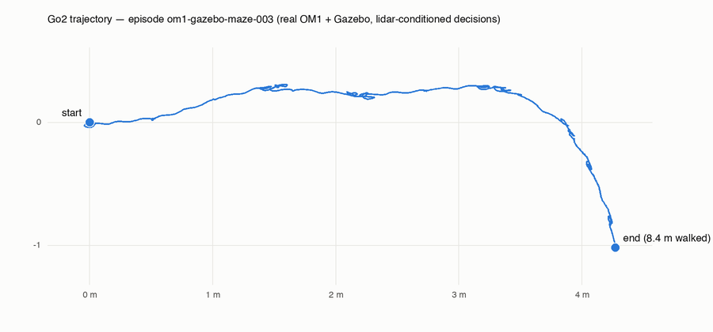

# The showcase episode — real OM1, real physics, real perception (§9, §15)

Episode **`om1-gazebo-maze-003`**: the unmodified OM1 Go runtime driving a
physics-simulated Unitree Go2 through a maze, with **every byte of perception and
action genuine** — simulated lidar → `om_path` → the fused prompt's "safe movement
directions" → a live cloud Cortex → `Move` tool calls → champ gait control →
Gazebo physics → odometry back into OM1. Recorded zero-touch by Plumbline,
headlessly, on a Modal T4 (`modal/gazebo_om1.py`).



## The numbers

| | |
|---|---|
| Seam events recorded | **4,095** (153 Cortex decisions + 3,942 `DECIDE_TO_ACT`) |
| Real `cmd_vel` CDR `Twist` frames tapped | 3,789, on the pinned bare `cmd_vel` key |
| Distance physically walked | **8.374 m** through `maze_world` |
| Perception | `sim:r100` — 179 lidar-derived path messages, **15 distinct safe-direction states** |
| Decisions | 135× *move forwards*, 14× *turn right*, 1× *turn left*, 2× *move back* |
| Faithful replay | **byte-identical over all 4,095 events** — on the Modal container AND re-verified locally on a different machine/architecture |

## Why this episode is the flagship

**The language bus carried real, changing perception — and it is all in the
trace.** The recorded fused prompts themselves contain five distinct
safe-direction states: 84 ticks all-clear, 46 ticks where *turn left* was not
safe (wall on the robot's left), 16 ticks where both turns were barred, and the
decisions track them — the sustained right-turn arc in the trajectory sits
exactly where *turn left* dropped out of the prompt. Five forward commands were
additionally blocked by the connector's own barrier check when the lidar saw a
wall at close range: the LiDAR-dog scenario's machinery, working, in a
reproducible recording.

**Nothing in the loop is stubbed.** Odometry, paths, actuation, and physics are
the sim's own; the Cortex is a real vLLM endpoint at temperature; OM1 is the
unmodified binary at a pinned commit. The recording harness adds exactly two
sim-gap shims, both zero-touch and both documented upstream findings
([om1-integration.md](om1-integration.md)): a body-height lift on relayed
odometry (champ's odom is planar; the real Go2 firmware reports height, and
OM1's Move connector requires "standing") and a key rename for the sim's
range-keyed path topics (`/om/paths/r100` → the bare `om/paths` OM1 subscribes).

**Reproduce it:**

```bash
modal deploy modal/llm.py
modal run modal/gazebo_om1.py::record --llm-url <llm url> \
  --seconds 240 --episode-id my-episode --world maze_world --paths-range r100
modal volume get plumbline-traces my-episode-store .
plumbline replay --store my-episode-store --episode my-episode   # serve it back
```

The run self-verifies (seam counts, observed bus keys, connector-gate counts,
faithful-replay digest check, meters traveled) and persists the trace before any
teardown. A `probe` entrypoint diagnoses the sim's sensor chain link by link,
and `doctor` health-checks the image's seven components — the two tools that
made this episode a two-command reproduction instead of an afternoon of
debugging.

## Honest notes

- At temperature 0.7 with `tool_choice: "required"`, the decider explores gently
  — most ticks choose *move forwards* when it is safe, which is also what the
  policy prompt asks of it. The perception-conditioned turns are the signal.
- The episode is only as varied as four minutes of 1 Hz decisions allows
  (~150 ticks). Longer recordings are one CLI flag away.
- `distinct_path_states: 15` counts raw lidar path-set configurations relayed;
  the five states quoted above are those that survived into fused prompts at
  decision instants.
- Turn convergence is real controller-vs-plant dynamics: champ turns slower than
  the Move controller's patience on some commands ("turn not converging"
  aborts appear in the OM1 log), which is faithfully part of the recording.
